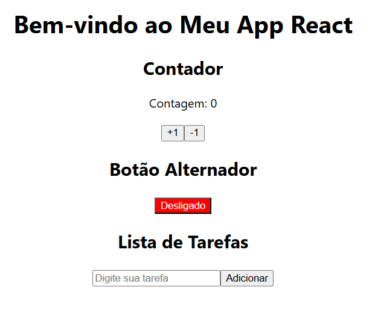

## Exercício 1: Contador Simples com useState

### O que foi pedido:

1. Criar um componente chamado `Contador`.
2. O componente deve exibir:
   - Um número que começa em 0.
   - Dois botões: um para incrementar (+1) e outro para decrementar (-1).
3. Utilizar o hook `useState` para gerenciar o estado do número exibido.
4. Desafio Extra:
   - Adicionar uma validação para impedir que o número fique negativo.

### O que foi feito:

1. **Componente `Contador`**: 
   - O componente usa o hook `useState` para manter o estado do contador.
   - Inicializamos o contador com o valor 0.
   - Criamos dois botões, um para incrementar o contador e outro para decrementá-lo. A função de decremento inclui uma validação que impede que o contador fique negativo, verificando se o valor é maior que 0 antes de realizar a operação.
   
```javascript
import React, { useState } from "react";

function Contador() {
  const [contador, setContador] = useState(0);

  const incrementar = () => setContador(contador + 1);
  const decrementar = () => setContador(contador > 0 ? contador - 1 : 0); // Impede números negativos

  return (
    <div className="contador">
      <h2>Contador</h2>
      <p>Contagem: {contador}</p>
      <button onClick={incrementar}>+1</button>
      <button onClick={decrementar}>-1</button>
    </div>
  );
}

export default Contador;


## Exercício 2: Alterando o Texto de um Botão

### O que foi pedido:

1. Criar um componente chamado `BotaoAlternador`.
2. O componente deve ter:
   - Um botão que exibe "Ligado" ou "Desligado", dependendo do estado atual.
3. Ao clicar no botão, o estado deve alternar entre "Ligado" e "Desligado".
4. Utilizar o hook `useState` para gerenciar o estado do texto.
5. Desafio Extra:
   - Adicionar um estilo CSS diferente para cada estado ("Ligado" em verde e "Desligado" em vermelho).

### O que foi feito:

1. **Componente `BotaoAlternador`**:
   - O componente alterna o texto do botão entre "Ligado" e "Desligado" usando o hook `useState`.
   - O estado inicial é "Desligado", e ao clicar no botão, o texto alterna entre "Ligado" e "Desligado".
   - Além disso, a cor do botão muda de acordo com o estado: verde quando "Ligado" e vermelho quando "Desligado".
   
```javascript
import React, { useState } from "react";

function BotaoAlternador() {
  const [estado, setEstado] = useState("Desligado");

  const alternarEstado = () => {
    setEstado(estado === "Ligado" ? "Desligado" : "Ligado");
  };

  return (
    <div className="botao-alternador">
      <h2>Botão Alternador</h2>
      <button 
        onClick={alternarEstado} 
        style={{ backgroundColor: estado === "Ligado" ? 'green' : 'red', color: 'white' }}
      >
        {estado}
      </button>
    </div>
  );
}

export default BotaoAlternador;


### Exercício 3: Gerenciando uma Lista de Tarefas

### O que foi pedido:

1. Criar um componente chamado `ListaDeTarefas`.
2. O componente deve exibir:
   - Um campo de texto para digitar o nome da tarefa.
   - Um botão "Adicionar".
   - Uma lista de tarefas adicionadas.
3. Utilizar o hook `useState` para gerenciar o estado da lista de tarefas e o valor do campo de texto.
4. O campo de texto deve atualizar o estado a cada mudança.
5. Ao clicar no botão "Adicionar", o valor do campo deve ser incluído na lista, e o campo deve ser limpo.
6. Desafio Extra:
   - Adicionar a funcionalidade de remover uma tarefa da lista ao clicar nela.

### O que foi feito:

1. **Componente `ListaDeTarefas`**:
   - O componente possui um campo de texto para digitar a tarefa e um botão para adicionar à lista.
   - Usamos o `useState` para controlar tanto o valor do campo de texto quanto a lista de tarefas.
   - Ao adicionar uma tarefa, o campo de texto é limpo.
   - A lista de tarefas é exibida e, ao clicar em uma tarefa, ela é removida da lista.
   
```javascript
import React, { useState } from "react";

function ListaDeTarefas() {
  const [tarefa, setTarefa] = useState('');
  const [tarefas, setTarefas] = useState([]);

  const adicionarTarefa = () => {
    if (tarefa) {
      setTarefas([...tarefas, tarefa]);
      setTarefa(''); // Limpa o campo de texto
    }
  };

  const removerTarefa = (index) => {
    const novasTarefas = tarefas.filter((_, i) => i !== index);
    setTarefas(novasTarefas);
  };

  return (
    <div className="lista-tarefas">
      <h2>Lista de Tarefas</h2>
      <input 
        type="text" 
        value={tarefa} 
        onChange={(e) => setTarefa(e.target.value)} 
        placeholder="Digite sua tarefa"
      />
      <button onClick={adicionarTarefa}>Adicionar</button>
      <ul>
        {tarefas.map((tarefa, index) => (
          <li key={index} onClick={() => removerTarefa(index)}>
            {tarefa}
          </li>
        ))}
      </ul>
    </div>
  );
}

export default ListaDeTarefas;
